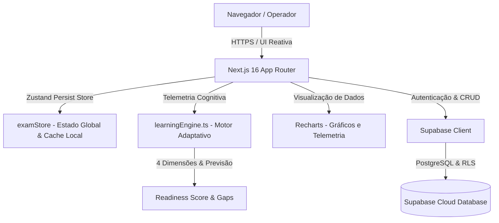

# CyberCert (ROOT SEC ACADEMY)
## Documentação Técnica e Operacional do Projeto

---

### Sumário
1. [Visão Geral e Propósito](#1-visão-geral-e-propósito)
2. [Arquitetura de Tecnologia](#2-arquitetura-de-tecnologia)
3. [Estrutura de Pastas e Componentes](#3-estrutura-de-pastas-e-componentes)
4. [Módulos e Funcionalidades da Plataforma](#4-módulos-e-funcionalidades-da-plataforma)
5. [Motor de Aprendizagem Adaptativa (Learning Intelligence)](#5-motor-de-aprendizagem-adaptativa-learning-intelligence)
6. [Modelo de Dados (Supabase / PostgreSQL)](#6-modelo-de-dados-supabase--postgresql)
7. [Controle de Acesso e Perfis (RBAC)](#7-controle-de-acesso-e-perfis-rbac)
8. [Guia de Configuração e Execução](#8-guia-de-configuração-e-execução)
9. [Fluxos Operacionais (Manuais de Uso)](#9-fluxos-operacionais-manuais-de-uso)
10. [Diretrizes de Segurança e Boas Práticas](#10-diretrizes-de-segurança-e-boas-práticas)
11. [Roadmap e Próximos Passos](#11-roadmap-e-próximos-passos)

---

## 1. Visão Geral e Propósito

O **CyberCert (ROOT SEC ACADEMY)** é uma plataforma web corporativa de **aprendizagem adaptativa e preparação prática** para equipes de segurança da informação, SOC, Blue Team e infraestrutura em certificações internacionais (CompTIA Security+, Cisco CCNA, Fortinet NSE4, etc.).

A plataforma evoluiu de um sistema tradicional de simulados para um **ecossistema de inteligência pedagógica**, capaz de diagnosticar lacunas técnicas, prever a probabilidade de aprovação e recomendar trilhas de reforço cirúrgicas através de telemetria cognitiva em tempo real.

### Objetivos Corporativos:
* **Simulação de Alta Fidelidade:** Reproduzir fielmente as condições das provas oficiais (tempo cronometrado ininterrupto, 90 questões aleatórias, nota de corte oficial de 750/900 e PBQs).
* **Motor Adaptativo (Learning Engine):** Calcular índices matemáticos de prontidão (*Readiness Score*) baseados em 4 dimensões (Performance, Retenção, Consistência e Aplicação).
* **Eliminação de Vícios e Gaps:** Mapear erros reincidentes via *Modo Retaliação 2.0* e programar revisões táticas pela curva de esquecimento (*Repetição Espaçada*).
* **Fixação por Domínio e Skills:** Associação granular de questões a conceitos técnicos (IAM, RBAC, Criptografia, etc.).
* **Resiliência e Relatórios:** Recuperação automática de simulados interrompidos por F5 (*Zustand Persist*) e exportação corporativa de relatórios de prontidão em PDF.

---

## 2. Arquitetura de Tecnologia



### Tecnologias Utilizadas:
| Camada | Tecnologia | Descrição |
| :--- | :--- | :--- |
| **Framework Web** | Next.js 16.3 (Turbopack) | App Router moderno com renderização SSR e Client Components otimizados. |
| **Biblioteca de UI** | React 19 | Interfaces reativas com tipagem estrita e animações contextuais. |
| **Linguagem** | TypeScript 5 | Tipagem estática rigorosa para garantir integridade e ausência de falhas em runtime. |
| **Estilização** | Tailwind CSS v4 | Estilização utilitária com design tático dark mode profissional e estilos `@media print`. |
| **Ícones** | Lucide React | Conjunto abrangente de ícones de cibersegurança e telemetria. |
| **Gráficos** | Recharts | Renderização de gráficos temporais de notas e radar setorial. |
| **Gerência de Estado**| Zustand 5 + Persist | Gerenciamento de estado com cache no `localStorage` para recuperação de sessões. |
| **Backend & Banco** | Supabase (PostgreSQL) | Autenticação por token JWT, banco relacional gerenciado e políticas RLS granulares. |

---

## 3. Estrutura de Pastas e Componentes

```text
d:\CyberCert\
├── public/                     # Recursos estáticos (logos, ícones)
├── src/
│   ├── app/
│   │   ├── favicon.ico         # Ícone da aplicação
│   │   ├── globals.css         # Design tokens, variáveis de tema e estilos @media print
│   │   ├── layout.tsx          # Layout raiz com metadados e fontes Geist
│   │   ├── page.tsx            # Aplicação SaaS principal (Lobby, Intelligence, Simulados, Labs)
│   │   └── simulado/
│   │       └── page.tsx        # Rota espelho redirecionada
│   ├── components/
│   │   └── ui/                 # Componentes primitivos (button, card, progress, etc.)
│   ├── lib/
│   │   ├── learningEngine.ts   # Motor de Aprendizagem Adaptativa e telemetria cognitiva
│   │   ├── supabase.ts         # Inicialização resiliente do cliente Supabase
│   │   └── utils.ts            # Utilitários de classes CSS (clsx + tailwind-merge)
│   └── stores/
│       └── examStore.ts        # Store global Zustand com persistência local e ações
├── supabase/
│   └── migrations/
│       └── 20260921_adaptive_learning.sql  # Schema SQL com Skills, Tentativas e RLS
├── .env.example                # Documentação de variáveis de ambiente
├── .env.local                  # Credenciais ativas locais (ignorado no Git)
├── doc.md                      # Documentação técnica completa
├── package.json                # Dependências e scripts npm
└── tsconfig.json               # Configurações do compilador TypeScript
```

---

## 4. Módulos e Funcionalidades da Plataforma

### 4.1. Learning Intelligence (Aba Padrão da Certificação)
* **Certification Readiness (4D):** Mede o nível de prontidão em escala de 0 a 100%, combinando Performance (40%), Retenção (20%), Consistência (20%) e Aplicação (20%).
* **Prevenção de Falsos Positivos:** Thresholds mínimos (mínimo de 10 questões para o índice inicial) evitando porcentagens enganosas.
* **Diagnóstico de Gaps (Pontos Fracos):** Identifica domínios críticos com amostragem adequada (mínimo de 5 questões) e aponta tendências (Melhora, Queda ou Estável).
* **Recomendação Preditiva (Próximo Alvo):** Sugere automaticamente o próximo domínio a ser estudado com botão de início imediato.
* **Exportação Executiva em PDF:** Botão "Exportar Relatório (PDF)" com formatação executiva pronta para impressão/submissão corporativa.

### 4.2. Repetição Espaçada & Curva de Esquecimento
* Classifica questões com base no histórico do aluno e feedbacks cognitivos:
  * **Nova:** Questão nunca respondida.
  * **Difícil / Em Reforço (24h):** Questões com erros recentes, erros repetidos ou chutes confessados.
  * **Revisão Programada (3 dias):** Questões acertadas recentemente em consolidação.
  * **Dominada (7+ dias):** 2 ou mais acertos consecutivos sem reincidência de erros.
* **Botão "Iniciar Revisão":** Lança uma bateria tática focada exclusivamente nas questões pendentes na fila de repetição.

### 4.3. Modo Retaliação 2.0 (Anti-Vício)
* Além de identificar erros pontuais, rastreia **questões reincidentes** (erradas duas ou mais vezes em sessões distintas).
* Prioriza os pontos cegos persistentes até a eliminação completa dos vícios conceituais.

### 4.4. Operação Real (Simulado Oficial de 90 Questões)
* 90 questões sorteadas via algoritmo uniforme **Fisher-Yates**.
* Cronômetro ininterrupto de 90 minutos com finalização automática em `00:00`.
* Nota de corte oficial: **750 de 900 pontos** (83,3% de aproveitamento).
* **Persistência de Sessão:** Se a página for recarregada (F5), o simulado continua exatamente da questão, tempo e respostas em que parou.

### 4.5. Estudo Tático & Desafio Diário
* Filtro por domínio individualizado com gabarito instantâneo e justificativas técnicas detalhadas.
* **Feedback Cognitivo Pós-Resposta:** Opção para o aluno informar como chegou à resposta (*"Eu sabia o conceito"*, *"Fiquei em dúvida"*, *"Chutei"*, *"Confundi conceitos"*, *"Errei por interpretação"*, *"Não sabia"*). Esse dado calibra o algoritmo de repetição espaçada.
* Explicação bilateral: Por que a resposta oficial está correta e por que a resposta assinalada pelo operador está incorreta.
* Desafio Diário (5 questões) e cálculo de ofensiva contínua (*Streak*).

### 4.6. Simuladores Práticos (PBQs)
* **Firewall ACL Lab:** Ordenação Top-Down com validação de regras de firewall corporativo.
* **Troubleshooting CLI Lab:** Terminal de rede com comandos simulados (`ping`, `tracert`, `ipconfig`).
* **Cenários Práticos de Resposta a Incidentes (CompTIA Security+).**

### 4.7. Fórum de Debates por Questão
* Espaço de colaboração técnica com ordenação por mais úteis/recentes, upvotes, menções `@nome` e denúncia de conteúdo indevido.

### 4.8. Painel Administrativo de Questões com Governança
* Cadastro de novas questões com suporte a **Skills Técnicas** (tags separadas por vírgula), campos de governança (`source`, `author`, `review_status`) e gabaritos comentados.

---

## 5. Motor de Aprendizagem Adaptativa (Learning Intelligence)

O módulo `src/lib/learningEngine.ts` implementa a inteligência computacional da plataforma de forma determinística, testável e desacoplada da camada visual:

### Constantes e Limiares Centralizados (`LEARNING_THRESHOLDS`)
```typescript
export const LEARNING_THRESHOLDS = {
  MIN_QUESTIONS_READINESS_INITIAL: 10,     // < 10: Dados insuficientes (score = null)
  MIN_QUESTIONS_READINESS_DEVELOPING: 30,  // 10-29: Inicial, 30-59: Em desenvolvimento
  MIN_QUESTIONS_READINESS_ADVANCED: 60,    // 60+: Preparação avançada / Alta consistência
  MIN_QUESTIONS_WEAK_AREA: 5,             // Mínimo para classificar ponto fraco
  PASSING_SCORE: 750,                     // Nota de corte oficial (CompTIA/Cisco)
  MAX_SCORE: 900,                         // Pontuação máxima oficial
  BENCHMARK_MASTERY_PERCENT: 85,          // Meta para alta consistência
  BENCHMARK_WEAK_PERCENT: 70,             // Limite para alerta de ponto fraco
  MIN_CONSECUTIVE_CORRECT_FOR_MASTERY: 2, // Acertos consecutivos para domínio
} as const;
```

### Cálculo das 4 Dimensões do Readiness Score (Sem Dados Fictícios):
1. **Performance (Peso 40%):** 
   - Fórmula: `(total_acertos / total_questões) * 100`.
   - Requisito: Mínimo de 10 questões avaliadas. Se `< 10`, retorna `null` e estado `insufficient_data`.
2. **Retenção (Peso 20%):**
   - Fórmula: Compara taxa de acerto das sessões mais antigas vs. mais recentes (`taxa_recente + (delta > 0 ? 5 : 0)`).
   - Requisito: Mínimo de 2 sessões distintas. Caso contrário, retorna `null` com status pendente de dados temporais.
3. **Consistência (Peso 20%):**
   - Fórmula: `100 - (desvio_padrao * 1.5)`. Se todas as notas forem idênticas (stdDev = 0), a regularidade é 100%.
   - Requisito: Mínimo de 3 sessões para variância estatística. Caso contrário, retorna `null`.
4. **Performance Under Exam Conditions / Exam Application (Peso 20%):**
   - Fórmula: `(taxa_aprovacao_oficial * 0.4) + ((media_pontos_oficial / 900) * 100 * 0.6)`.
   - Requisito: Mínimo de 1 Simulado Oficial de 90 questões cronometrado. Caso contrário, retorna `null`.
   - **Escopo Estrito:** Representa estritamente o rendimento do operador sob condições formais e pressão de tempo de prova oficial. Não infere capacidade prática externa nem simula desempenho em PBQs a partir de questões teóricas.

### Comportamento do Readiness Score Provisório:
* Quando o operador possui $\ge 10$ questões mas faltam dimensões como Retenção, Consistência ou Condições de Exame, o sistema **não atribui valores fictícios ou inventados**.
* Para evitar que uma performance isolada (ex: 100% de acertos em 1 única sessão) seja apresentada visualmente como *"Readiness 100%"*, o valor público `overallPercentage` é definido como `null`.
* Um valor consolidado ponderado (`provisionalScore`) é mantido apenas internamente para calibrar recomendações de estudo.
* A interface exibe com clareza o estado **"Índice Provisório"**, listando o status de cada dimensão (ex: `Performance: 100%`, `Retenção: Dados insuficientes`, etc.).
* **Aviso Institucional:** O Readiness Score é uma métrica diagnóstica formativa interna para autogestão de estudos e **não constitui garantia nem previsão contratual de aprovação em exames oficiais**.

### Normalização Canônica de Skills:
* A função `normalizeSkillSlug(raw)` sanitiza strings removendo acentuação, espaços e caracteres especiais (ex: `IAM`, `iam`, ` Identity and Access Management ` convertem-se para `iam` ou `identity-and-access-management`).
* Evita fragmentação da telemetria e duplicação de conceitos no banco.

---

## 6. Modelo de Dados (Supabase / PostgreSQL)

### 6.1. Histórico Agregado (`exam_history`) vs. Tentativas Granulares (`user_question_attempts`)
* **Limitações do Histórico Legado (`exam_history`):** O formato histórico original armazena dados agregados (`score`, `correct_count`, `total_questions`, `incorrect_questions: string[]`, `domain_stats: jsonb`). Ele **não possui** timestamp individual por questão, tempo de reação em milissegundos nem feedback cognitivo do operador.
* **Solução e Coexistência:** Para manter retrocompatibilidade total sem perda de respostas antigas, `exam_history` continua sendo gravado e lido normalmente. Paralelamente, cada finalização de simulado insere registros individuais na nova tabela `user_question_attempts`, amarrados pelo campo `exam_history_id` e enriquecidos com `domain`, `cert_id`, `confidence_level` e `selected_answer`.
* **Idempotência no `finishExam`:** O store Zustand implementa a flag de controle `isSubmittingExam: boolean` e verificação de `isFinished`. Chamadas repetidas por duplo clique ou reexecuções de rede são ignoradas, prevenindo registros duplicados no banco. Em caso de falha de conexão, o estado local do exame é preservado com segurança para o operador.

### 6.2. Estrutura das Tabelas Criadas pela Migração `20260921_adaptive_learning.sql`
1. **`skills`:** Conceitos técnicos oficiais com restrição `UNIQUE(cert_id, slug)`.
2. **`question_skills`:** Tabela associativa relacional com deleção em cascata (`ON DELETE CASCADE`).
3. **`user_question_attempts`:** Livro-razão (*ledger*) append-only das respostas individuais do operador.
4. **`increment_comment_upvote`:** Função RPC atômica (`SECURITY DEFINER`) em PostgreSQL para evitar race conditions em upvotes simultâneos do fórum.

### 6.3. Políticas de Segurança (Row Level Security - RLS)
* **`user_question_attempts`:**
  * `SELECT`: Apenas o próprio usuário (`auth.uid() = user_id`).
  * `INSERT`: Apenas o próprio usuário (`auth.uid() = user_id`).
  * `UPDATE / DELETE`: Bloqueados para usuários convencionais (imutabilidade de telemetria).
* **`skills` & `question_skills`:** Leitura aberta a usuários autenticados; edição restrita a administradores verificados via token JWT (`app_metadata.role = 'admin'`).
* **Ausência de `service_role`:** O frontend utiliza estritamente o cliente com `NEXT_PUBLIC_SUPABASE_ANON_KEY`. Nenhuma chave administrativa reside no código cliente.

---

## 7. Controle de Acesso e Perfis (RBAC)

O controle de privilégios é validado tanto na interface quanto protegido por **Row Level Security (RLS)** no PostgreSQL:

```typescript
const isSuperAdmin = Boolean(
  user?.app_metadata?.role === 'admin' ||
  user?.app_metadata?.is_admin ||
  user?.user_metadata?.role === 'admin' ||
  user?.user_metadata?.is_admin ||
  user?.email?.toLowerCase() === 'admin@rootsec.io'
);
```

* **Operador:** Acessa seus próprios resultados em `exam_history` e `user_question_attempts`, realiza simulados, revisões e debates.
* **Super Administrador:** Possui privilégios para cadastrar e gerenciar questões no banco através da aba **Admin**.

---

## 8. Guia de Configuração e Execução

### Pré-requisitos
* **Node.js:** Versão 20.x ou superior.
* **NPM:** Gerenciador de dependências.
* **Supabase:** Projeto ativo com as variáveis de ambiente configuradas.

### 1. Clonar e Instalar
```bash
git clone https://github.com/YuriVss1/cybercert.git
cd cybercert
npm install
```

### 2. Configurar Variáveis de Ambiente (`.env.local`)
```env
NEXT_PUBLIC_SUPABASE_URL=https://qtimoxxxkwgrueoerdnv.supabase.co
NEXT_PUBLIC_SUPABASE_ANON_KEY=sb_publishable_xxxxxx
```

### 3. Executar Migrações no Supabase
Execute o script `supabase/migrations/20260921_adaptive_learning.sql` no **SQL Editor** do painel do Supabase.

### 4. Executar em Desenvolvimento
```bash
npm run dev
```
Acesse em: `http://localhost:3000`.

### 5. Validação de Integridade e Build
```bash
# Validação de tipagem TypeScript estrita
npx tsc --noEmit

# Análise estática ESLint
npm run lint

# Build de produção otimizado com Turbopack
npm run build
```

---

## 9. Fluxos Operacionais (Manuais de Uso)

### Fluxo 1: Diagnóstico de Prontidão e Recomendação de Estudo
1. Ao selecionar uma certificação no Lobby, o sistema abre diretamente a aba **Learning Intelligence**.
2. O operador visualiza seu **Certification Readiness Score** (ou "Dados Insuficientes" caso tenha menos de 10 respostas).
3. Na caixa **Próximo Alvo**, analisa o motivo do diagnóstico pedagógico e clica em **Estudar Agora (15 Q.)**.
4. O sistema abre a sessão de treino filtrada exatamente naquele domínio prioritário.

### Fluxo 2: Sessão de Repetição Espaçada
1. Na aba **Learning Intelligence**, verifique a seção **Repetição Espaçada // Curva de Esquecimento**.
2. O sistema exibe o total de questões que necessitam de revisão de 24 horas (erros/chutes recentes) e 3 dias.
3. Clique em **Iniciar Revisão** para consolidar a memória de longo prazo antes que o esquecimento ocorra.

### Fluxo 3: Exportação do Relatório em PDF
1. Na aba **Learning Intelligence**, clique no botão **Exportar Relatório (PDF)** no canto superior direito.
2. A janela de impressão do sistema operacional abrirá com layout executivo limpo (sidebar ocultada, cabeçalho institucional exibido).
3. Selecione "Salvar como PDF" para arquivar ou encaminhar à coordenação de cibersegurança.

---

## 10. Diretrizes de Segurança e Boas Práticas

1. **Credenciais Seguras:** Nunca versione chaves secretas (`service_role`) no repositório. Use apenas a `anon` key no cliente web.
2. **Políticas de RLS Estritas:** Cada analista só consulta e grava suas próprias tentativas na tabela `user_question_attempts`.
3. **Propriedade Intelectual:** Questões devem ser mantidas e revisadas por instrutores autorizados, com campos `source` e `author` preenchidos.
4. **Resiliência de Estado:** O estado do simulado é serializado no armazenamento local do navegador, garantindo que oscilações de rede não interrompam exames oficiais.

---

## 11. Roadmap e Próximos Passos

* [x] **Motor de Aprendizagem Adaptativa:** Algoritmos de Readiness 4D, análise de gaps e recomendação automática.
* [x] **Repetição Espaçada:** Fila inteligente de retenção por intervalos de memória.
* [x] **Modo Retaliação 2.0:** Detecção e treinamento focado em falhas reincidentes.
* [x] **Persistência de Sessão Local:** Recuperação automática de simulados via middleware Zustand Persist.
* [x] **Exportação de Relatórios em PDF:** Emissão de diagnósticos executivos formatados para envio corporativo.
* [ ] **Suporte a Novas Certificações:** Adicionar trilhas para CEH (Certified Ethical Hacker), AWS Certified Security Specialty e CISSP.
* [ ] **Modo Simulado por Equipes:** Dashboard para gestores e líderes técnicos avaliarem o índice coletivo de prontidão do time.

---

*Documentação mantida pela equipe ROOT SEC ACADEMY.*
